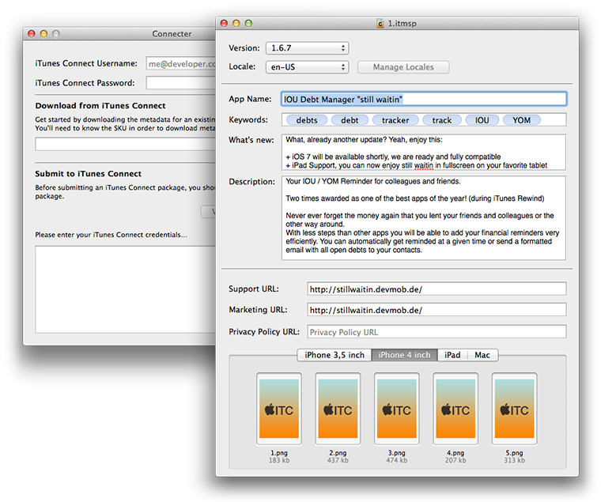

Connecter
===========

Connecter is an OS X app to help you interact with iTunes Connect. It allows you to download/edit & update app metadata from and for iTunes Connect. If you’ve got Xcode installed, you’re all sorted and ready to use this with your Apple ID and password.

Connecter is a work-in-progress, built quickly to allow us to improve our own iTunes Connect workflow. For the more seasoned developers amongst us, looking back at the commit history you can probably tell that the codebase was written in a morning by a Product Manager :-). 

We’re open-sourcing it because we think it might be useful to other iOS and OS X developers, and because as we add more features to the app it’ll save all of us time.

If you’ve got any feedback, feel free to open an Issue, submit a Pull Request or contact nikf ([@nikf](https://twitter.com/nikf)) or jaydee3 ([@jaydee3](https://twitter.com/jaydee3)). Thanks to [Damien DeVille](https://twitter.com/damiendeville) for the code review.

## Screenshots

## Contributors

- [Nik Fletcher](https://twitter.com/nikf), Realmac Software
- [Damien DeVille](https://twitter.com/damiendeville), Realmac Software
- [Markus Emrich](https://twitter.com/jaydee3), nxtbgthng GmbH

## Contributors

- [Nik Fletcher](https://twitter.com/nikf), Realmac Software
- [Damien DeVille](https://twitter.com/damiendeville), Realmac Software
- [Markus Emrich](https://twitter.com/jaydee3), nxtbgthng GmbH

## Points of Interest

- Connecter is sandboxed. However as the iTMSTransporter binary requires read-write access to ~/.itmstransporter/ Connecter has a temporary entitlement for this location.
- We won’t be suppling a downloadable app for Connecter. Given the sensitive nature of your iTunes Connect credentials, we’re providing the fully-auditable source code that you can then build.

## Still To-Do

**Core:**

- Better presentation of feedback from the Transporter binary.
- Support retrieval of In-App Purchase and Game Center metadata.
- Persist login details in the Keychain.
- Error handling.

**Editor:**

- Make locales list editable (remove/add locales)
- Reuse existing NSFileWrapper (don't rewrite screenshots, if no changes happened)
- Make the "Download from ITC" part its own window (shown when creating a new file)
- Make the verify/submit part its own window (shown when verify/submit is selected in the menu, while a document is open)
- Move ITC credentials into a separate settings window
- ~~Add a document icon~~ be91b16
- Support drag & drop for multiple screenshots at once, automatically assign correct device types
- Support drag & drop reordering of screenshots
- Visible Input validation (required fields, Max length. especially for keywords, screenshot size/format)

## License

Connecter is released under the MIT License:

	The MIT License (MIT)

	Copyright (c) 2014 Realmac Software & Contributors

	Permission is hereby granted, free of charge, to any person obtaining a copy
	of this software and associated documentation files (the "Software"), to deal
	in the Software without restriction, including without limitation the rights
	to use, copy, modify, merge, publish, distribute, sublicense, and/or sell
	copies of the Software, and to permit persons to whom the Software is
	furnished to do so, subject to the following conditions:

	The above copyright notice and this permission notice shall be included in all
	copies or substantial portions of the Software.

	THE SOFTWARE IS PROVIDED "AS IS", WITHOUT WARRANTY OF ANY KIND, EXPRESS OR
	IMPLIED, INCLUDING BUT NOT LIMITED TO THE WARRANTIES OF MERCHANTABILITY,
	FITNESS FOR A PARTICULAR PURPOSE AND NONINFRINGEMENT. IN NO EVENT SHALL THE
	AUTHORS OR COPYRIGHT HOLDERS BE LIABLE FOR ANY CLAIM, DAMAGES OR OTHER
	LIABILITY, WHETHER IN AN ACTION OF CONTRACT, TORT OR OTHERWISE, ARISING FROM,
	OUT OF OR IN CONNECTION WITH THE SOFTWARE OR THE USE OR OTHER DEALINGS IN THE
	SOFTWARE.
